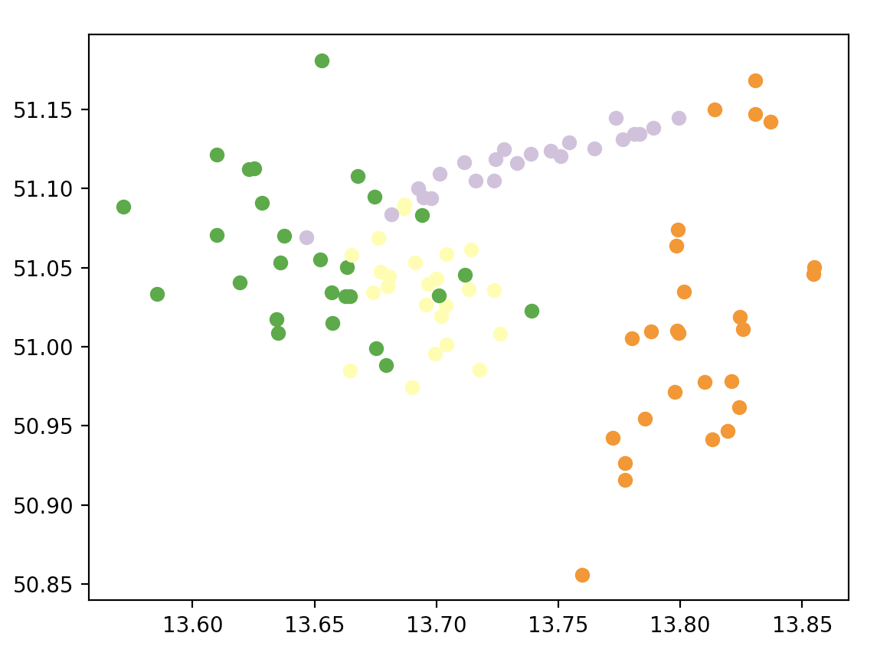

# Spatio-semantic Dataset Generator

## About
This repository contains code to generate spatio-semantic clusters.
Each cluster is defined by a stretched and rotated Gaussian.
Points are drawn from each Gaussian and assigned to a random class from a dedicated branch of the overall class hierarchy.
The class hierarchy is generated in accordance with the overall cluster generation setting.
This means that if we have _n_ clusters, a random class hierarchy will be generated that has _n_ top level classes (i.e. direct subclasses of `owl:Thing`).
The generated dataset can then be used by spatio-semantic clustering methods to try to retrieve back the clusters.

## How to run
This repo (at least at the moment) is meant to be used as library with the function `datasetgenerator.generate( )`being the main import of interest.
`generate( )` takes the following input parameters:

- `num_points: int`: The number of (spatial) points to be generated 
- `num_classes: int`: The number of classes in the class hierarchy to be generated 
- `num_clusters: int`: The number of clusters
- `lat_min: float`: Minimum latitude of the bounding box where spatial points should be generated in
- `lat_max: float`: Maximum latitude of the bounding box where spatial points should be generated in 
- `lon_min: float`: Minimum longitude of the bounding box where spatial points should be generated in
- `lon_max: float`: Maximum longitude of the bounding box where spatial points should be generated in 
- `output_file_path: str`: The file path where the resulting RDF dataset should be stored

When run, e.g. by calling

```python
>>> from datasetgenerator import generate
>>> # Dresden area
>>> lon_min = 13.6301
>>> lon_max = 13.8615
>>> lat_min = 50.9815
>>> lat_max = 51.1158
>>> generate(100, 50, 4, lat_min, lat_max, lon_min, lon_max, '/tmp/dataset.nt')
```

the `generate` function will generate a random class hierarchy printed on the console and show an image of the generated points.
An example class hierarchy could be

```
http://www.w3.org/2002/07/owl#Thing
 +-- http://ex.com/ont/Cls004
 |   +-- http://ex.com/ont/Cls005
 |   |   +-- http://ex.com/ont/Cls012
 |   |   +-- http://ex.com/ont/Cls042
 |   +-- http://ex.com/ont/Cls007
 |   |   +-- http://ex.com/ont/Cls008
 |   +-- http://ex.com/ont/Cls013
 |       +-- http://ex.com/ont/Cls021
 |       |   +-- http://ex.com/ont/Cls041
 |       +-- http://ex.com/ont/Cls039
 +-- http://ex.com/ont/Cls001
 |   +-- http://ex.com/ont/Cls009
 |   |   +-- http://ex.com/ont/Cls015
 |   |   +-- http://ex.com/ont/Cls010
 |   |   |   +-- http://ex.com/ont/Cls022
 |   |   |       +-- http://ex.com/ont/Cls028
 |   |   |       |   +-- http://ex.com/ont/Cls033
 |   |   |       +-- http://ex.com/ont/Cls027
 |   |   +-- http://ex.com/ont/Cls025
 |   |   +-- http://ex.com/ont/Cls044
 |   |       +-- http://ex.com/ont/Cls049
 |   +-- http://ex.com/ont/Cls018
 |   +-- http://ex.com/ont/Cls037
 |   +-- http://ex.com/ont/Cls017
 +-- http://ex.com/ont/Cls003
 |   +-- http://ex.com/ont/Cls011
 |   +-- http://ex.com/ont/Cls016
 |   |   +-- http://ex.com/ont/Cls031
 |   |       +-- http://ex.com/ont/Cls038
 |   +-- http://ex.com/ont/Cls032
 |   |   +-- http://ex.com/ont/Cls050
 |   +-- http://ex.com/ont/Cls040
 +-- http://ex.com/ont/Cls002
     +-- http://ex.com/ont/Cls029
     +-- http://ex.com/ont/Cls006
     |   +-- http://ex.com/ont/Cls019
     |   |   +-- http://ex.com/ont/Cls036
     |   |   |   +-- http://ex.com/ont/Cls048
     |   |   +-- http://ex.com/ont/Cls035
     |   |       +-- http://ex.com/ont/Cls043
     |   |           +-- http://ex.com/ont/Cls045
     |   +-- http://ex.com/ont/Cls023
     |   |   +-- http://ex.com/ont/Cls024
     |   |   +-- http://ex.com/ont/Cls046
     |   +-- http://ex.com/ont/Cls030
     |   |   +-- http://ex.com/ont/Cls034
     |   +-- http://ex.com/ont/Cls014
     |       +-- http://ex.com/ont/Cls026
     |       +-- http://ex.com/ont/Cls020
     +-- http://ex.com/ont/Cls047
```

The corresponding spatial points colored by cluster could look like this:


If the proposed generated hierarchy and point distribution looks OK, one can close the points plot and answer to the prompted question:

```
Keep this random dataset? (y/n)
```

If answered with `n`(o), the generator will propose new random datasets until it is accepted with a `y`(es).
Then the corresponding RDF dataset will be written in the n-triples serialization format to the file path defined by `output_file_path`.